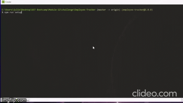

# Employee-Tracker

  ## Table of Content
  * [Description](#description)
  * [Instructions](#instructions)
  * [Demonstration](#demonstration)
  * [Contributions](#contributions)

## Description
Employee Tracker is a command-line application build with `node js` design to easily view, create, remove and update employees into MySQL server database.

### Packages Used

* [mysql2](https://www.npmjs.com/package/mysql2)
* [inquirer](https://www.npmjs.com/package/inquirer)
* [dotenv](https://www.npmjs.com/package/dotenv)
* [console.table](https://www.npmjs.com/package/console.table)

## Instructions

* Clone the project, run `git clone https://github.com/JulioRios15/Employee-Tracker.git` in your terminal.

* Navigate to [Employee-Tracker](./) folder `cd Employee-Tracker` and run `npm install` in your terminal

* To setup your mysql connection run `npm run setup`, or modify the config [database.ts](./src/config/database.ts) to include MySQL host, user, password and database information. You will be prompted with the following questions.

    * Enter mysql host, by default is set to `localhost`
    * Enter mysql user, by default is set to `root`
    * Enter mysql password
    * Enter mysql database
    * Do you want to create default schema for database? (yes, no) to define schema for inputted database if connection is set propertly
    * Do you want to seed the database? (yes, no) to seed the database with the default seeds

* To start the aplication and test if the connection is working propertly run `npm run start` in your terminal.

## Demonstration

`npm run setup` demo

Project Demo

[Watch demo video in youtube](https://youtu.be/YHdC5BRLnSE)

## Contributions
contributions are always welcome!

